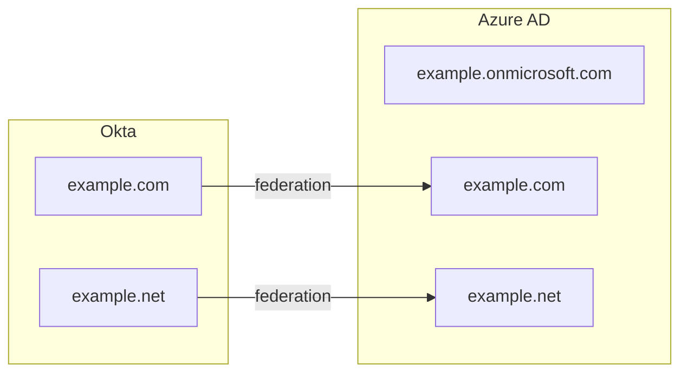
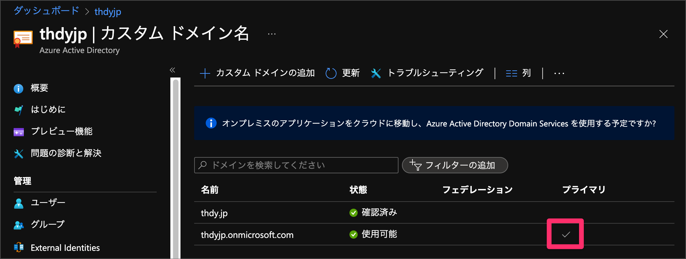

# はじめに
OktaをIdPにしてAzure AD(Microsoft 365)とのSSOとプロビジョニングをしようとしたところいくつかハマりポイントがあったので振り返りを含めポストします。
なおMicrosoft 365のバックグラウンドにある認証基盤はAzure ADなのでこの記事内では「Azure AD」に統一して書きます。

# 前提や環境
### 所有ライセンス
- Okta
  - SSO
  - MFA
  - Lifecycle Management
  - Universal Directory
- Azure AD
  - Microsoft Enterprise Mobility + Security E3
  - Microsoft 365 Apps for Business

### シナリオ
- 利用されているデバイスとしてはMacが中心
- Windowsデバイスも多少ある
  - オンプレミスのActive Directoryは無い
  - Windows PCはAzure AD Join + Intuneで管理されている
- Officeのライセンスは利用希望者のみに割り当てしている

# やりたいこと
- SSOの有効化
  - 認証をOktaに統一し利用する側の体験を良くする
  - アカウントロック対応等の運用負荷を下げる
- アカウントプロビジョニングの有効化
  - 入退社異動に伴うアカウント管理の工数の削減

# SSOを構成する
それではさっそくOktaをIdPとしてAzure ADとのシングルサインオンを構成したいと思います。

## ID連携プロトコル
SSOの方式としてよく使われているのはOpen ID ConnectとSAMLですが、OktaがサポートしているAzure ADとの連携方式はWS-Federationです。
正直Microsoft以外で使われているのを見たことがないです（他にあればぜひ教えて下さい）。
中身はほぼSAMLがベースのようですが興味がある方は[WS-Federationのパブリックドラフト](http://download.boulder.ibm.com/ibmdl/pub/software/dw/specs/ws-fed/WS-Federation-V1-1B.pdf)を読んでみてください。

## SSOできるドメインとできないドメイン
Azure ADはテナント作成時に自動作成されるドメイン（`{mydomain}.onmicrosoft.com`）と後から追加できるカスタムドメインがありますが、SSOできるのはカスタムドメインのみで `{mydomain}.onmicrosoft.com` のほうはSSOできません。
またカスタムドメインが複数ある場合はそれぞれOkta側でアプリを作成してSSOを設定するイメージとなります。

## Okta公式の手順
[Configure single sign on for Office 365 | Okta](https://help.okta.com/en/prod/Content/Topics/Apps/Office365-Deployment/configure-sso.htm)

上記リンク先がOktaの公式手順なのですが、今回試した中ではここに書いてある内容だけだとうまくいかない部分があったので以下に実際に行った手順を書いていきます。

## 実際に行った手順
### Azure AD側でやること
- カスタムドメインを追加する（まだ追加してなければ）
  - [カスタム ドメインを追加する - Azure Active Directory | Microsoft Docs](https://docs.microsoft.com/ja-jp/azure/active-directory/fundamentals/add-custom-domain)
- プライマリドメインを `{mydomain}.onmicrosoft.com` のほうにする
  - Azure Active Directory > カスタム ドメイン名 の画面で確認できます
  - 
  - プライマリになってなかったら `{mydomain}.onmicrosoft.com` をクリックして `プライマリにする` を選択します
- Azure Active Directory > プロパティ > セキュリティの既定値群の管理 > `セキュリティの既定値群の有効化` を `いいえ` にします
  - 
  - これを無効化しておかないと後で認証に失敗してエラーになります
  - 参考：[Office 365 WS-Fed Integration issue](https://support.okta.com/help/s/question/0D51Y00008QoNQN/office-365-wsfed-integration-issue?language=en_US)

### Okta側でやること

# アカウントプロビジョニングを有効化する

# アカウント発行からAzure AD Joinまでの流れ
