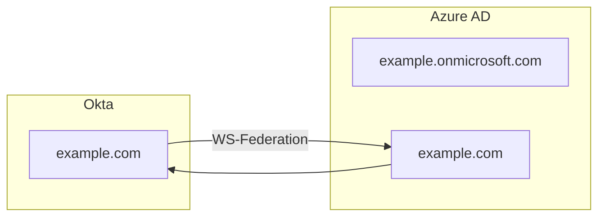

# はじめに
OktaをIdPとしてAzure AD(Microsoft 365)とフェデレーションを構成する際、[Okta公式のドキュメント](https://help.okta.com/en/prod/Content/Topics/Apps/Office365-Deployment/configure-sso.htm)通りだとうまくいかない部分がいくつかあったのでメモです。

# 前提
- Oktaをメインディレクトリとする
- オンプレミスのActive Directoryは無し
- Windows PCはAzure AD Joinにて運用している

なおOktaとAzure AD間でフェデレーションを構成するにはドメインごとにOkta側のアプリケーション設定を行う必要があります。
今回はOkta側をメインディレクトリとするためAzure AD側の `{mydomain}.onmicrosoft.com` のほうはフェデレーションの対象外となります。

下図はZennがmermaid.jsに対応したとのことでとりあえず使ってみたくて書いただけのフロー図です。

# 設定手順
## Azure AD側でやること
- カスタムドメインを追加する（まだ追加してなければ）
  - [カスタム ドメインを追加する - Azure Active Directory | Microsoft Docs](https://docs.microsoft.com/ja-jp/azure/active-directory/fundamentals/add-custom-domain)
- プライマリドメインを `{mydomain}.onmicrosoft.com` のほうにする
  - Azure Active Directory > カスタム ドメイン名 の画面で確認できます
  - 
  - プライマリになってなかったら `{mydomain}.onmicrosoft.com` をクリックして `プライマリにする` を選択します
- Azure Active Directory > プロパティ > セキュリティの既定値群の管理 > `セキュリティの既定値群の有効化` を `いいえ` にします
  - 
  - これを無効化しておかないと後で認証に失敗してエラーになります
  - 参考：[Office 365 WS-Fed Integration issue](https://support.okta.com/help/s/question/0D51Y00008QoNQN/office-365-wsfed-integration-issue?language=en_US)

### Okta側でやること

# アカウントプロビジョニングを有効化する

# アカウント発行からAzure AD Joinまでの流れ

